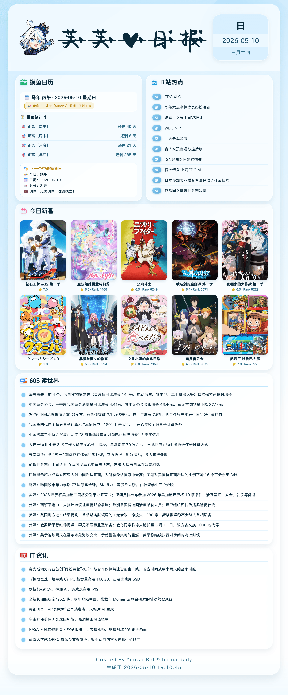
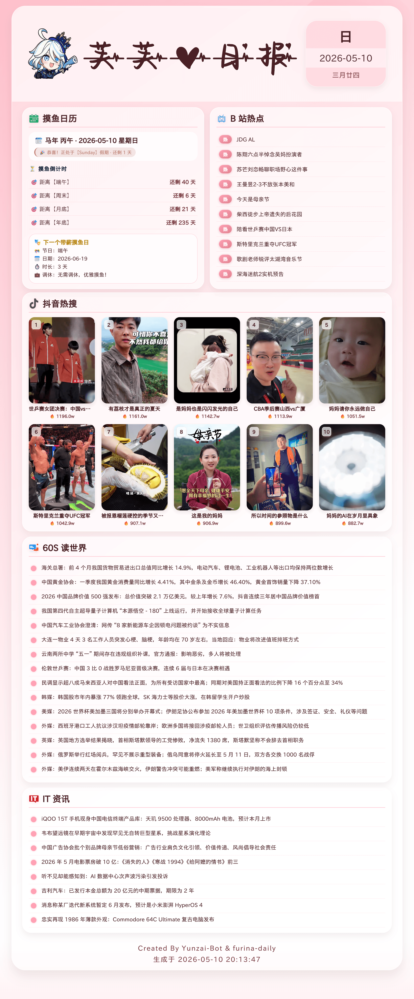
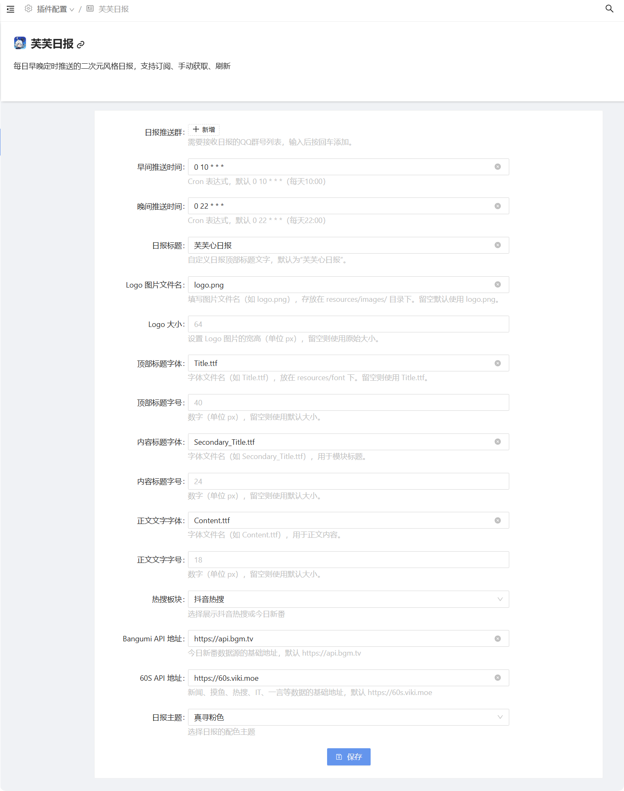

# 芙芙日报 · Furina Daily

每日自动生成精美日报图片，支持多群推送、锅巴可视化配置、一键更新、主题切换与热搜板块选择。

## 🖼 作品展示

### 芙芙日报 效果图
<details><summary>🖼日报　芙芙蓝色主题</summary><p>
<a></a>
</details>

<details><summary>🖼日报　真寻粉色主题</summary><p>
<a></a>
</details>

### 日报帮助 效果图
<details><summary>🖼帮助</summary><p>
<a></a>
</details>

### 锅巴配置 效果图
<details><summary>🖼锅巴</summary><p>
<a></a>
</details>

## ✨ 主要功能

- **定时推送**：可自定义早晚推送时间（默认 10:00 / 22:00），自动生成并发送至订阅群
- **手动获取**：随时获取最新日报，基于日期智能缓存，不重复生成
- **热搜板块**：下方大图区可切换「抖音热搜 / 今日新番（Bangumi）/ 头条热搜」，锅巴面板或指令随时更换
- **侧栏话题**：摸鱼日历旁的话题模块二选一 —— 「知乎话题榜」或「哔哩哔哩热搜」
- **主题切换**：内置「芙芙蓝色」「真寻粉色」双主题，锅巴或指令一键切换
- **图片压缩**：可开关日报图片压缩，支持 PNG（无压缩）/ PNG（无损）/ JPEG / WebP，JPEG、WebP 可调质量 1-100；指令「日报压缩 开/关」即时切换
- **自定义 API**：新闻、摸鱼、知乎、B站、IT、抖音、头条、新番每个数据源都能单独填 API 地址；请求失败会自动切换到内置公共实例
- **新番代理（可选）**：今日新番走的 Bangumi API（`api.bgm.tv`）与其图床目前只能境外网络直连。国内可在锅巴「数据源配置 → 新番代理前缀」填一个前缀式代理（如 `https://api.fate.vip/`），**接口请求与封面图会一起走这个通道**；留空即直连，与不加该功能时完全一致。代理地址不内置在插件里，随时可改可清空（填了之后只走代理，不再回退直连）
- **渲染预览**：指令「日报模拟」读取插件内置的 `resources/mock` 示例数据出一份日报（不联网、不占用今日缓存、可反复执行），用于快速预览主题 / 板块 / 侧栏 / 压缩等渲染效果；同一套示例数据在 API 全部失败时也会自动兜底
- **锅巴适配**：支持在 Guoba-Plugin 管理面板中可视化配置，且配置项按分类分成「推送配置 / 外观配置 / 内容配置 / 图片配置 / 数据源配置」五个 Tab（同 yenai-plugin 的组织方式），组内再分小节；「日报推送群」可直接从机器人群列表里勾选（支持按群名 / 群号搜索，也能手动输入群号），推送时间使用 Cron 选择器（带常用预设与人类可读释义）
- **帮助菜单**：生成精美的插件功能说明图片，每日缓存，内容随新功能同步更新
- **一键更新**：仅需发送指令即可 `git pull` 更新插件（仅 Bot 主人可用）
- **一键清空配置**：备份当前配置并恢复为默认设置（仅 Bot 主人可用）
- **自动清理**：每次生成后自动删除旧的日报图片，保持目录整洁

## 📦 安装方法

在 Yunzai-Bot 根目录下执行：

```bash
git clone --depth=1 https://github.com/anyliew/furina-daily.git ./plugins/furina-daily
cd ./plugins/furina-daily
pnpm i
```
⚙️ 配置说明
首次运行时插件会自动生成配置文件 config/config/daily.yaml。
推荐使用锅巴面板进行可视化配置（无需手动编辑 YAML）。

配置文件示例
```yaml
reportGroup:                 # 推送群号列表（建议用锅巴面板从群列表中选择）
  - 123456789
morningTime: '0 10 * * *'   # 早间推送 Cron 表达式
eveningTime: '0 22 * * *'   # 晚间推送 Cron 表达式
customTitle: '芙芙心日报'     # 自定义标题
logoImage: 'logo.png'        # Logo 文件名
logoSize: ''                 # Logo 尺寸，空为原始
titleFont: 'Title.ttf'       # 顶部标题字体
titleFontSize: ''            # 顶部标题字号，空为默认
secondaryTitleFont: 'Secondary_Title.ttf'
secondaryTitleFontSize: ''
contentFont: 'Content.ttf'
contentFontSize: ''
hotModule: 'douyin'          # 热搜板块：douyin / bangumi / toutiao
sideModule: 'zhihu'          # 侧栏话题：zhihu / bilibili
renderScale: 1               # 排版密度倍率（与渲染后端设备像素倍率相乘，shotium scale:2 下填 1 即两倍图）
compressImage: true          # 是否压缩日报图片
compressFormat: 'png'        # png-none / png / jpeg / webp
compressQuality: 80          # 仅 jpeg、webp 生效
apiBase:
  bangumi: 'https://api.bgm.tv'
  viki: 'https://60s.viki.moe'
# 新番代理前缀：留空=直连；国内访问不了 Bangumi 时填 https://api.fate.vip/ 这类前缀式代理
proxy:
  bangumi: ''
theme: 'blue'                # 主题：blue（芙芙蓝色） / pink（真寻粉色）
```
修改后会在几秒内自动重载，无需重启。

提示：安装 Guoba-Plugin 后，可在 “插件配置” 中直接管理以上所有字段。

## 📁文件结构

```text
furina-daily
├── apps
│   ├── daily.js                # 定时推送、命令响应主逻辑
│   ├── help.js                 # 帮助菜单生成与缓存
│   └── update.js               # 插件自更新
├── config
│   └── default_config
│       └── daily.yaml          # 默认配置模板（含所有字段）
├── guoba
│   ├── configInfo.js           # 锅巴配置读写桥接（支持 apiBase、theme 等）
│   ├── index.js                # 锅巴入口
│   ├── pluginInfo.js           # 锅巴插件信息
│   └── schemas                 # 配置面板按分类拆分成多个 Tab（同 yenai-plugin 的做法）
│       ├── push.js             # 推送配置（推送群、早晚推送时间）
│       ├── appearance.js       # 外观配置（标题、Logo、字体、主题）
│       ├── content.js          # 内容配置（热搜板块、侧栏模块）
│       ├── image.js            # 图片配置（压缩开关/格式/质量、渲染倍率）
│       ├── api.js              # 数据源配置（通用地址 + 各模块独立地址）
│       ├── other.js            # 其他配置（默认配置自动合并开关）
│       └── index.js            # Schema 汇总
├── guoba.support.js            # 锅巴插件注册
├── index.js                    # 插件入口
├── package.json
├── resources
│   ├── font
│   │   ├── Content.ttf         # 正文字体
│   │   ├── Secondary_Title.ttf # 内容标题字体
│   │   └── Title.ttf           # 主标题字体
│   ├── html
│   │   ├── base.html           # 蓝色主题主骨架
│   │   ├── base_pink.html      # 粉色主题主骨架（与base布局一致）
│   │   ├── css
│   │   │   ├── daily.css       # 蓝色主题样式
│   │   │   └── daily-pink.css  # 粉色主题样式
│   │   └── partials            # 模块子模板（共用）
│   │       ├── head.html
│   │       ├── header.html
│   │       ├── moyu.html
│   │       ├── bilibili.html
│   │       ├── bangumi.html    # 新番模块
│   │       ├── douyin.html
│   │       ├── news.html
│   │       └── footer.html
│   ├── images
│   │   ├── logo.png            # 日报 Logo
│   │   └── furina.png          # 芙宁娜图标（帮助用）
│   ├── mock                    # 本地示例数据（「日报模拟」预览 + API 失败兜底）
│   │   ├── *.json              # 各模块示例数据
│   │   └── images/             # 示例封面图
│   └── svg                     # 模块图标
│       ├── calendar.svg
│       ├── bilibili.svg
│       ├── douyin.svg
│       ├── it.svg
│       └── news.svg
└── src
    ├── dataFetcher.js          # 数据聚合调度（联网抓取 / 本地示例数据）
    ├── index.js                # 渲染后端适配与出图，按 theme 选择模板
    ├── fetchers                # 各 API 数据获取（支持自定义 base）
    │   ├── news60s.js
    │   ├── moyu.js
    │   ├── zhihu.js
    │   ├── bilibili.js
    │   ├── bangumi.js          # Bangumi 新番抓取（apiBase.bangumi + 可选 proxy.bangumi 代理）
    │   ├── douyin.js
    │   ├── itNews.js
    │   └── toutiao.js
    ├── mock                    # 示例数据仓库与静态兜底数据（API 失败时使用）
    │   ├── store.js            # resources/mock 读写与图片路径解析
    │   ├── news60s.js
    │   ├── moyu.js
    │   ├── zhihu.js
    │   ├── bilibili.js
    │   ├── bangumi.js
    │   ├── douyin.js
    │   ├── itNews.js
    │   └── toutiao.js
    └── utils
        ├── date.js             # 农历与日期工具
        ├── format.js           # 数值格式化
        └── logger.js           # 统一日志
```

## 📄致谢

- **灵感来源**：[`nonebot-plugin-zxreport`](https://github.com/HibiKier/nonebot-plugin-zxreport)—— 可爱的小真寻记者为你献上今日报道！
- **60s API**：[`vikiboss/60s`](https://github.com/vikiboss/60s) —— 提供新闻、摸鱼、热搜等数据
- **Bangumi API**：[`bangumi/api`](https://github.com/bangumi/api) —— 提供番剧日历与剧集数据

## 📄 License
本项目使用 [AGPL-3.0 license]许可证。
请注意资源目录中的字体版权，需自行替换为可商用字体或获取授权。