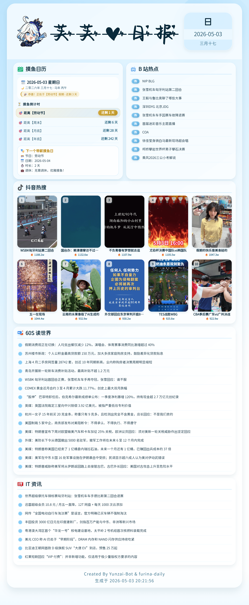
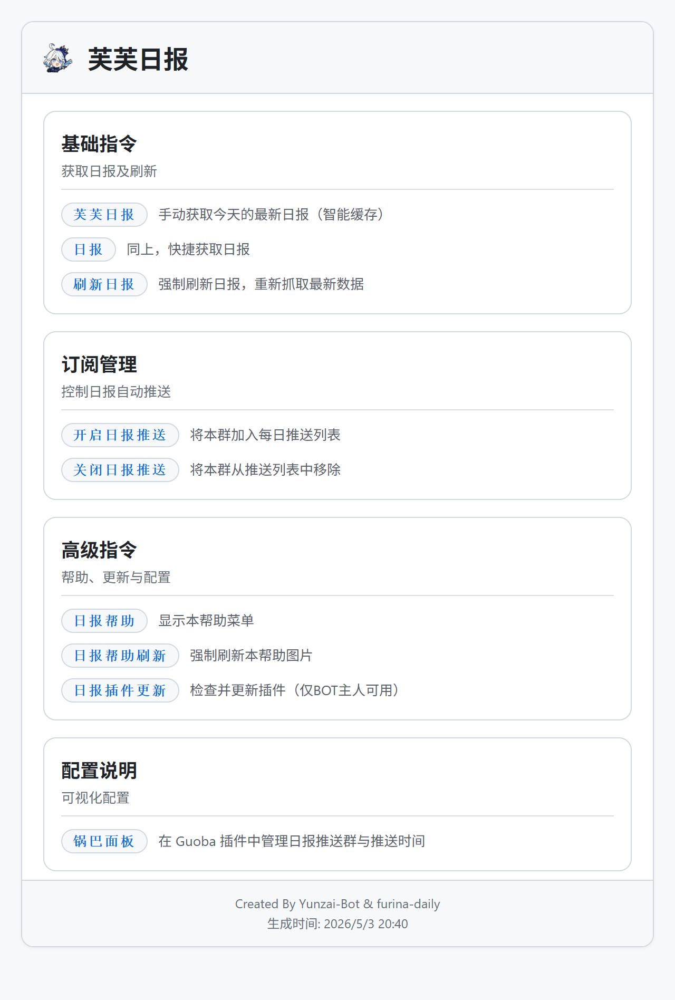

# 芙芙日报 · Furina Daily

每日自动生成精美日报图片，支持多群推送、锅巴可视化配置、一键更新等。

## 🖼 作品展示

### 芙芙日报 效果图
<details><summary>🖼日报</summary><p>
<a></a>
</details>

### 日报帮助 效果图
<details><summary>🖼帮助</summary><p>
<a></a>
</details>

## ✨ 主要功能

- **定时推送**：可自定义早晚推送时间（默认 10:00 / 22:00），自动生成并发送至订阅群
- **手动获取**：随时获取最新日报，基于日期智能缓存，不重复生成
- **锅巴适配**：支持在 Guoba-Plugin 管理面板中可视化配置推送群与时间
- **帮助菜单**：生成精美的插件功能说明图片，每日缓存
- **一键更新**：仅需发送指令即可 `git pull` 更新插件（仅 Bot 主人可用）
- **自动清理**：每次生成后自动删除旧的日报图片，保持目录整洁


## 📦 安装方法

在 Yunzai-Bot 根目录下执行：

```bash
git clone --depth=1 https://github.com/anyliew/furina-daily.git ./plugins/furina-daily
cd ./plugins/furina-daily
pnpm i
```


## ⚙️ 配置说明

首次运行时插件会自 动生成配置文件 `config/config/daily.yaml`。
**推荐使用锅巴面板**进行可视化配置（无需手动编辑 YAML）。

### 配置文件示例

```
reportGroup:
  - 123456789       # 推送群号
morningTime: '0 10 * * *'   # 早间推送 Cron 表达式
eveningTime: '0 22 * * *'   # 晚间推送 Cron 表达式
```

修改后会在几秒内自动重载，无需重启。

> **提示**：安装 [Guoba-Plugin](https://gitee.com/guoba-yunzai/guoba-plugin) 后，可在 “插件配置” 中直接管理上述三项。


## 📝 指令列表

| 指令           | 说明                         | 可用范围    |
| :- | : | :- |
| `开启日报推送` | 将当前群加入每日推送列表     | 仅群聊      |
| `关闭日报推送` | 将当前群移出推送列表         | 仅群聊      |
| `芙芙日报`     | 获取今日日报（优先使用缓存） | 群聊 / 私聊 |
| `日报`         | 同上，快捷获取日报           | 群聊 / 私聊 |
| `刷新日报`     | 强制重新生成日报并返回图片   | 群聊 / 私聊 |
| `日报帮助`     | 生成插件帮助菜单图片         | 群聊 / 私聊 |
| `日报帮助刷新` | 强制刷新帮助菜单图片         | 群聊 / 私聊 |
| `日报插件更新` | 从 Git 拉取最新代码更新插件  | 仅 Bot 主人 |


## 📁 文件结构

```
furina-daily
├── apps
│   ├── daily.js                # 定时推送、命令响应主逻辑
│   ├── help.js                 # 帮助菜单生成与缓存
│   └── update.js               # 插件自更新
├── config
│   └── default_config
│       └── daily.yaml          # 默认配置模板
├── guoba
│   ├── configInfo.js           # 锅巴配置读写桥接
│   ├── index.js                # 锅巴入口
│   ├── pluginInfo.js           # 锅巴插件信息
│   └── schemas
│       ├── daily.js            # 日报配置表单
│       └── index.js            # Schema 汇总
├── guoba.support.js            # 锅巴插件注册
├── index.js                    # 插件入口
├── package.json
├── resources
│   ├── font
│   │   ├── Content.ttf         # 正文字体
│   │   └── Title.ttf           # 标题字体
│   ├── html                    # Nunjucks 模板文件
│   │   ├── base.html           # 日报主骨架
│   │   ├── css
│   │   │   └── daily.css       # 日报样式
│   │   └── partials            # 模块子模板
│   │       ├── head.html
│   │       ├── header.html
│   │       ├── moyu.html
│   │       ├── bilibili.html
│   │       ├── douyin.html
│   │       ├── news.html
│   │       └── footer.html
│   ├── images
│   │   └── logo.png            # 日报 Logo
│   └── svg                     # 模块图标
│       ├── calendar.svg
│       ├── bilibili.svg
│       ├── douyin.svg
│       ├── news.svg
│       └── it.svg
└── src
    ├── dataFetcher.js          # 数据聚合调度
    ├── index.js                # Puppeteer 渲染与截图
    ├── fetchers                # 各 API 数据获取
    │   ├── news60s.js
    │   ├── moyu.js
    │   ├── bilibili.js
    │   ├── douyin.js
    │   ├── itNews.js
    │   └── quote.js
    ├── mock                    # 模拟数据（API 失败时使用）
    │   ├── news60s.js
    │   ├── moyu.js
    │   ├── bilibili.js
    │   ├── douyin.js
    │   ├── itNews.js
    │   └── quote.js
    └── utils
        ├── date.js             # 农历与日期工具
        ├── format.js           # 数值格式化
        └── logger.js           # 统一日志
```


## 🛠️ 依赖说明

| 依赖               | 用途                        |
| :-- | :-- |
| `axios`            | HTTP 请求（获取热点、新闻） |
| `date-fns`         | 公历日期格式化              |
| `lunar-javascript` | 真实农历转换                |
| `node-schedule`    | 定时任务调度                |
| `nunjucks`         | HTML 模板渲染               |
| `puppeteer`        | 日报 / 帮助图片截图         |
| `sharp`            | PNG 图片压缩                |
| `js-yaml`          | 读写 YAML 配置文件          |


##  📄致谢

- **`nonebot-plugin-zxreport`**
  - **灵感来源**：[`nonebot-plugin-zxreport`](https://github.com/HibiKier/nonebot-plugin-zxreport)
- **`60s API`**
  - **API调用**：[`60s API`](https://github.com/vikiboss/60s)
  - **说明**：本项目依赖此API获取数据，为内容生成提供了关键数据支持。

## 📄 License

本项目使用 [GPL-3.0]许可证。
请注意资源目录中的字体版权，需自行替换为可商用字体或获取授权。